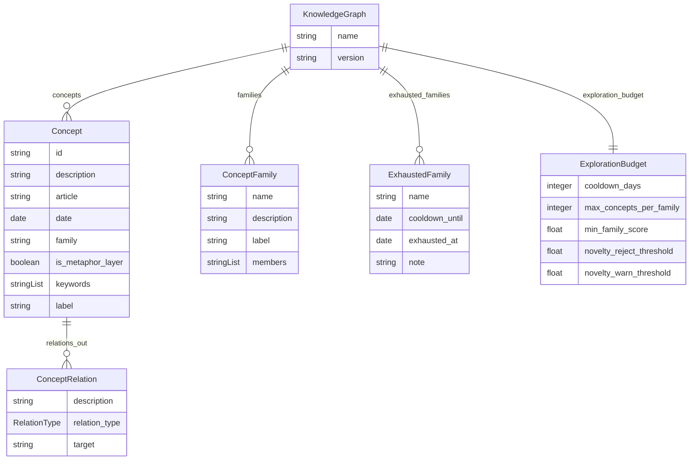

```mermaid
erDiagram
Concept {
    string id  
    string description  
    string article  
    date date  
    string family  
    boolean is_metaphor_layer  
    stringList keywords  
    string label  
}
ConceptFamily {
    string name  
    string description  
    string label  
    stringList members  
}
ConceptRelation {
    string description  
    RelationType relation_type  
    string target  
}
ExhaustedFamily {
    string name  
    date cooldown_until  
    date exhausted_at  
    string note  
}
ExplorationBudget {
    integer cooldown_days  
    integer max_concepts_per_family  
    float min_family_score  
    float novelty_reject_threshold  
    float novelty_warn_threshold  
}
KnowledgeGraph {
    string name  
    string version  
}

Concept ||--}o ConceptRelation : "relations_out"
KnowledgeGraph ||--|| ExplorationBudget : "exploration_budget"
KnowledgeGraph ||--}o Concept : "concepts"
KnowledgeGraph ||--}o ConceptFamily : "families"
KnowledgeGraph ||--}o ExhaustedFamily : "exhausted_families"

```

